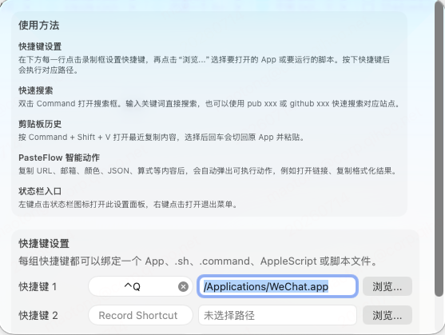

# SnapFlow

[English](#english) | [中文](#中文)

## 中文

这是一个 macOS 桌面软件 **SnapFlow**,一个快捷键效率工具。



## SnapFlow 能帮你做什么

SnapFlow 是一款常驻菜单栏的 macOS 效率工具，把「打开应用、搜索、粘贴」这些每天重复几十次的动作，都收敛到键盘上，让你的手不用离开键盘、注意力不用离开当前窗口。

### ⌨️ 一键启动常用应用和脚本

给你最常用的三个应用或脚本各绑一个全局快捷键，无论正在用什么软件，按一下就能打开或运行——不用再切到 Finder、Dock 里翻找。

- 支持打开任意 `.app`，也支持运行 `.sh`、`.command`、`.scpt`、`.applescript` 脚本。
- 快捷键自己录，绑定的应用/脚本随时可改。
- 已录的快捷键会同步显示在菜单里，一眼就知道按哪个键。

### 🔍 双击 Command 即刻搜索

想搜点东西，不用先打开浏览器、再点开新标签页。**双击 Command 键**，屏幕中央弹出搜索框，输入回车直接出结果。

- 可在 Bing / Google 之间切换，选择会被记住。
- 支持快捷前缀：`pub 关键字` 直达 pub.dev，`github 关键字` 直达 GitHub 仓库搜索。

### 📋 剪贴板历史，复制过的都找得回来

系统只保留最后一次复制的内容，SnapFlow 帮你留住最近 **50 条**。按 **`Command+Shift+V`** 调出历史，挑一条回车，自动切回你刚才的应用并粘贴进去。

- 文本、图片、文件都能记录。
- 每条历史标注来源应用（名称 + 图标），一眼认出「这是从哪儿复制的」。

### ⚡️ PasteFlow：复制完，下一步动作已经为你备好

这是 SnapFlow 最省心的地方。你在**任意应用**里复制内容，SnapFlow 会自动识别它是什么，并在**鼠标旁**弹出一个不打断你的小面板，把最可能的下一步动作直接递到你面前——`⏎` 执行，`Esc` 关掉。

举几个例子：

- 复制一条 **链接** → 直接在浏览器打开
- 复制一个 **邮箱** → 直接写邮件
- 复制一段 **压缩的 JSON** → 面板里立刻看到格式化后的样子
- 复制一个 **时间戳**（如 `1700000000`）→ 自动换算成可读的日期时间
- 复制一个 **算式**（如 `12+3*4`）→ 直接算出结果
- 复制一个 **颜色值**（如 `#FF8800`）→ 面板里显示对应色块

支持识别的完整类型见下方 [PasteFlow 智能面板](#pasteflow-智能面板)。

> 双击 Command 与 PasteFlow 需要监听全局键盘/剪贴板事件，因此首次使用时系统会提示开启「辅助功能 / 输入监控」权限。

### PasteFlow 智能面板

PasteFlow 参考 [PurePaste](https://github.com/xiaoyunchengzhu/PurePaste)，接入现有的剪切板轮询：每当检测到新复制的内容，就用 `PasteFlowDetector` 判定类型，命中后在光标附近弹出一个 `.nonactivatingPanel` 浮动面板，不会把主窗口带到前台。面板上有内容摘要与主操作按钮，`⏎` 执行、`Esc` 关闭，点击别处自动消失。

当前支持识别的类型（按「先具体后宽泛」的顺序判定，返回第一个命中）：

| 类型 | 说明 |
|------|------|
| URL | 带 `http(s)://` 前缀且可解析，主操作为在浏览器打开 |
| JSON | 以 `{` 或 `[` 开头且可被解析，面板内展示格式化（缩进 + 键排序）后的 JSON |
| 邮箱 | 标准邮箱格式，主操作为发起 `mailto:` |
| IP 地址 | IPv4 四段 0-255，拒绝前导零 |
| 颜色 | `#RGB`、`#RRGGBB`、`rgb(r,g,b)`，面板会展示对应色块 |
| 日期时间 | ISO8601 或常见 `yyyy-MM-dd`、`yyyy/MM/dd HH:mm` 等格式 |
| 时间戳 | 10 位秒级 / 13 位毫秒级 Unix 时间戳，自动格式化成 `yyyy-MM-dd HH:mm:ss` |
| 数学式 | 仅含数字与 `+ - * / ( ) .`，用手写递归下降解析器求值 |
| 电话 | 清洗后为 7-15 位数字的号码 |
| 快递单号 | 覆盖顺丰、圆通、UPS、FedEx 等有限模式，并非穷尽 |

检测逻辑（`PasteFlowDetector`）不依赖 AppKit，作为纯逻辑抽离并配有单元测试；面板 UI 与动作执行在 `PasteFlowWindowController` 中。检测顺序有意做了消歧：日期时间排在电话/数学式之前，时间戳排在电话/快递单号之前，避免纯数字或含 `-` 的串被误判。地址识别是兜底启发式，英文路名缩写只按独立单词匹配，避免把 `keywordTypeDao`、`findKeywordTypeByName` 这类代码标识符误判成地图地址。

## 系统要求

- macOS 10.11+
- Xcode（Swift tools 5.3+）
- 部分 SwiftUI 界面需要 macOS 10.15+

## 运行

如果下载 GitHub Releases 自动构建的压缩包，首次打开 `SnapFlow.app` 时 macOS 可能会提示“无法打开，因为 Apple 无法检查其是否包含恶意软件”或安全性被阻止。请到「系统设置」→「隐私与安全性」，在安全提示处点击「仍要打开」，之后即可正常启动。

用 Xcode 打开：

```sh
open SnapFlow.xcodeproj
```

运行 `SnapFlowExample` scheme。

应用启动后：

1. 在主窗口给 `Shortcut 1/2/3` 录制快捷键。
2. 点击 `Browse...` 选择一个 `.app` 或脚本文件。
3. 按下对应快捷键执行绑定动作。
4. 双击 Command 打开搜索框。
5. 按 `Command+Shift+V` 打开剪切板历史。
6. 在任意应用里复制可识别的内容，光标附近会弹出 PasteFlow 面板。

## 开发命令

编译内部快捷键逻辑（Swift Package target）：

```sh
swift build
```

运行测试：

```sh
xcodebuild -project SnapFlow.xcodeproj -scheme SnapFlowTests test
```

运行 SwiftLint：

```sh
swiftlint
```

## 测试覆盖

测试位于 `SnapFlowTests`：

- `SnapFlowTests.swift`：覆盖快捷键设置、读取、重置，以及 `onKeyDown` 在按键未抬起前只触发一次。
- `ClipboardHistorySelectionTests.swift`：覆盖剪切板历史的选择、预览标题、来源文案、去重和不同内容类型区分。
- `SearchEngineTests.swift`：覆盖 Bing / Google 搜索 URL 生成。
- `PasteFlowDetectorTests.swift`：覆盖 URL、邮箱、IP、颜色、日期、时间戳、JSON、数学式、电话、地址等类型的正例与关键负例（纯数字不判为数学式/时间戳、非法 IP 段与非法 JSON 应拒绝、代码标识符不误判为地址等）。

## 代码结构

```text
Sources/SnapFlowKit/     # 应用内部的全局快捷键实现
  CarbonSnapFlowKit.swift # Carbon 全局快捷键注册和事件分发
  SnapFlowKit.swift       # 快捷键注册/回调 API
  Name.swift                      # 快捷键名称
  Shortcut.swift                  # 快捷键模型、字符显示、菜单匹配
  Key.swift                       # Carbon key code 的 Swift 包装
  Recorder.swift                  # SwiftUI 录制控件
  RecorderCocoa.swift             # AppKit 录制控件
  NSMenuItem++.swift              # 菜单项快捷键同步
  util.swift                      # 事件监听、Alert、关联对象等工具

SnapFlowExample/         # macOS 应用本体
  AppDelegate.swift               # 状态栏、菜单、搜索窗、剪切板历史
  ContentView.swift               # 主窗口和三个快捷键动作
  ClipboardHistorySelection.swift # 剪切板历史纯逻辑
  SearchEngine.swift              # 搜索引擎选择和 URL 生成
  PasteFlowDetector.swift         # PasteFlow 内容类型检测（纯逻辑 + 数学解析器）
  PasteFlowWindowController.swift # PasteFlow 浮动面板 UI 与动作执行

SnapFlowTests/
  SnapFlowTests.swift
  ClipboardHistorySelectionTests.swift
  SearchEngineTests.swift
  PasteFlowDetectorTests.swift
```

## 注意事项

- 快捷键代码是应用的内部实现；`Package.swift` 只保留一个内部 target 用于单独编译这部分逻辑。
- 剪切板历史通过定时轮询 `NSPasteboard.general.changeCount` 实现。
- 粘贴历史项时，应用会恢复之前的前台应用并发送 `Command+V`。
- 双击 Command 监听需要系统权限；权限不足时会回退并提示用户开启。
- 工程仍保留 macOS 10.11 部署目标。

## License

MIT。

---

## English

This is a macOS desktop app — **SnapFlow**, a growing shortcut/productivity tool.

The code under `Sources/SnapFlowKit` is an **internal implementation detail** of the app (global shortcut registration, recording, and dispatch). The app itself lives in `SnapFlowExample`.

## What SnapFlow does for you

SnapFlow is a menu-bar macOS tool that collapses the things you do dozens of times a day — launching apps, searching, pasting — down to a keystroke, so your hands stay on the keyboard and your attention stays on the window in front of you.

### ⌨️ Launch your go-to apps and scripts instantly

Bind a global shortcut to each of your three most-used apps or scripts. Whatever you're doing, one keystroke opens or runs it — no digging through Finder or the Dock.

- Opens any `.app`, and runs `.sh`, `.command`, `.scpt`, and `.applescript` scripts.
- You record the shortcuts and can rebind the target app/script anytime.
- Recorded shortcuts show up in the menu so you always know which key does what.

### 🔍 Search with a double-tap of Command

Want to look something up? No need to open a browser and a new tab first. **Double-tap Command**, type into the panel that pops up, hit return.

- Switch between Bing / Google; your choice is remembered.
- Prefixes: `pub <term>` jumps to pub.dev, `github <term>` jumps to a GitHub repo search.

### 📋 Clipboard history — get back anything you copied

macOS only keeps your last copy; SnapFlow keeps the last **50**. Press **`Command+Shift+V`**, pick an entry, hit return — it switches back to your previous app and pastes it in.

- Remembers text, images, and files.
- Each entry is tagged with its source app (name + icon), so you can tell where it came from at a glance.

### ⚡️ PasteFlow — the next step is ready the moment you copy

This is where SnapFlow saves you the most. Copy something in **any** app, and SnapFlow recognizes what it is and pops a small, non-intrusive panel **next to your cursor** with the most likely next action — `⏎` to run it, `Esc` to dismiss.

A few examples:

- Copy a **link** → open it in the browser
- Copy an **email address** → start a new mail
- Copy **minified JSON** → see it pretty-printed right in the panel
- Copy a **timestamp** (e.g. `1700000000`) → get the readable date/time
- Copy a **math expression** (e.g. `12+3*4`) → see the result
- Copy a **color** (e.g. `#FF8800`) → see the color swatch

See [PasteFlow Smart Panel](#pasteflow-smart-panel) below for the full list of recognized types.

> Double-tap Command and PasteFlow monitor global keyboard/clipboard events, so macOS will ask you to grant Accessibility / Input Monitoring permission the first time.

### PasteFlow Smart Panel

Inspired by [PurePaste](https://github.com/xiaoyunchengzhu/PurePaste), PasteFlow hooks into the existing clipboard polling. Whenever new copied content is detected, `PasteFlowDetector` classifies it; on a hit, a `.nonactivatingPanel` floating window appears near the cursor without bringing the main window forward. The panel shows a summary plus a primary action button — `⏎` executes, `Esc` closes, clicking elsewhere dismisses it.

Recognized types (matched most-specific first, returning the first hit): URL, JSON (shown pretty-printed), email, IPv4 address, color (`#RGB` / `#RRGGBB` / `rgb(...)`, with a color swatch), date/time, Unix timestamp (10-digit seconds / 13-digit milliseconds, formatted to `yyyy-MM-dd HH:mm:ss`), math expression (evaluated by a hand-written recursive-descent parser), phone number, shipping tracking number (a limited set of patterns), and address. The detection order is intentionally disambiguated so plain numbers or `-`-containing strings are not misclassified as phone/math/timestamp. Address detection is a last-resort heuristic; English street abbreviations are matched as standalone words so code identifiers such as `keywordTypeDao` and `findKeywordTypeByName` are not treated as map addresses.

`PasteFlowDetector` is pure logic (no AppKit) and unit-tested; the panel UI and action execution live in `PasteFlowWindowController`.

## Requirements

- macOS 10.11+
- Xcode (Swift tools 5.3+)
- Some SwiftUI views require macOS 10.15+

## Run

If you download the auto-built package from GitHub Releases, macOS may block `SnapFlow.app` the first time because it is not notarized. Open System Settings → Privacy & Security, find the security warning, and click **Open Anyway**. After that, the app can launch normally.

```sh
open SnapFlow.xcodeproj
```

Run the `SnapFlowExample` scheme.

## Development

```sh
swift build
xcodebuild -project SnapFlow.xcodeproj -scheme SnapFlowTests test
swiftlint
```

## License

MIT.
